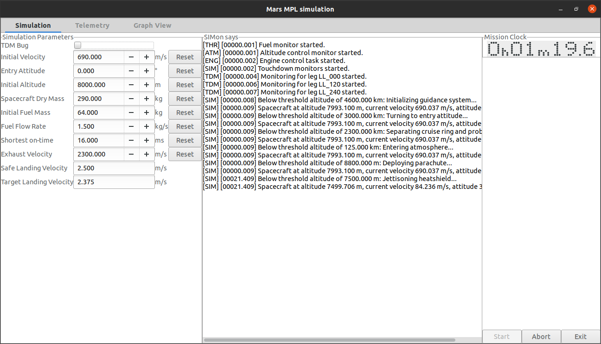
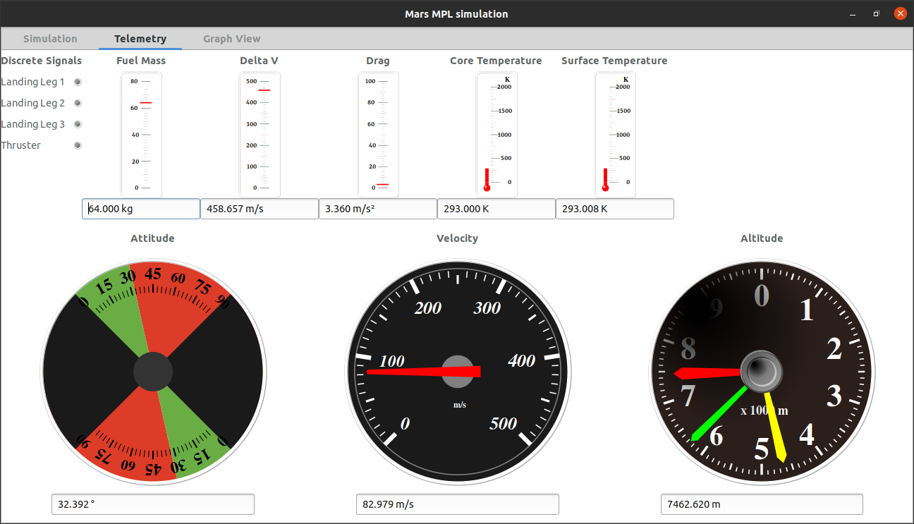

# Mars Polar Lander (Crash) Simulator

This was initially a toy project to see how the
[Mars Polar Lander crash](https://en.wikipedia.org/wiki/Mars_Polar_Lander#Loss_of_communications)
happened, and how it could have been prevented.

It escalated from there.

I started adding a GUI written in GtkAda, with the help of
[AICWL](http://dmitry-kazakov.de/ada/aicwl.htm), and then added more and more
stuff, now it looks colourful (and still ugly, I am no UI designer.)

## Source Code

I decided to release the source code, there is nothing special about it, but
for the uninitiated it might be fun to dig through it.

The software consists of two parts, the simulator, and the user interface to it.
The simulator can be run separately, it will spit out messages at certain
critical mission points (entering atmosphere, separating heatshield, deploying
lander, etc.).

The `mars_mpl` executable comprises the graphical user interface, from there
you can enable and disable the `TDM bug` and also change all kind of parameters
(initial height, approach velocity, fuel reserves, fuel consumption, etc. pp.)
and start/stop the simulator.

GUI part and simulator part communicate via `Shared_Passive` packages.

AICWL is defined as git submodule, so when cloning this directory you may want
to use the `--recurse-submodules` option with `git`.

### Source Layout

* `source/lander` contains the actual lander simulation
* `source/physics` gravity stuff, rocket equations
* `source/sim` Part of the lander, but everything that concerns only the simulation (external triggers, etc.)
* `source/ui` The GUI part, obviously
* `source/` Globally shared stuff (shared types, parameters, and logging)
* `aicwl` AICWL3.24 submodule

## Information Sources

This work is solely based on freely available sources from the internet and as
such may not be factually correct. I have no affiliation with any of the
involved parties. For easy access, I put all the documentation I used when
writing this into the `doc` directory. This includes basic information about MPL's
planned EDL (Entry, Descent, and Landing) phases as well as NASA's investigation
report.

## Screenshots

### Simulation Parameters

### Telemetry Display

